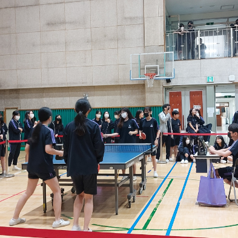
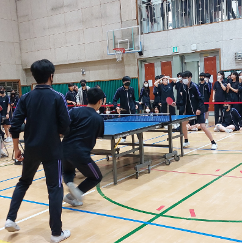
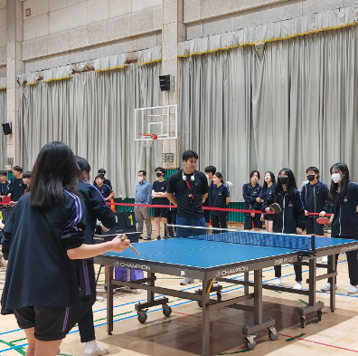

올해 2학년 학생들은 탁구 대회를 반대항전으로 진행하였다. 새로운 반이 된 뒤 첫 반대항전으로 연습하는 과정에서 서로 친해질 수 있는 기회였다. 탁구 대회의 시작을 연 1반과 3반을 이어 5반과 6반, 4반과 7반의 경기가 이어졌다. 그 뒤 3반과 6반, 2반과 7반의 준결승전, 3반과 7반이 결승전을 한 후, 최종 3반이 우승했다. 경기는 15점 내기 복식 경기로 이루어 졌고, 혼합복식도 있었다.

탁구 대회에 우승한 3반 김윤서 학생을 인터뷰해보았다.

### Q. 이번 탁구 대회를 하면서 좋았던 점이나 아쉬웠던 점이 있나요?

A. 탁구 경기를 연습하면서 친구들과 더 친해진 계기가 된 것 같아서 좋은 추억이 되었습니다. 탁구 경기를 열심히 연습한 만큼 좋은 결과가 나와서 기뻤습니다. 다른 반 학생들도 있는 곳에서 경기를 진행해서 많이 떨렸지만 응원을 받아서 즐겁게 경기에 임할 수 있었습니다. 긴장을 덜했다면 더 좋은 결과를 얻을 수 있었을텐데 실수를 한 것이 너무 아쉬웠습니다. 그래도 다같이 경기를 하고 연습하는 과정이 좋은 추억으로 남았습니다! 
 
많은 학생들이 구경하는 곳에서 경기를 하는게 떨리기도 했지만, 뿌듯한 경험이 되었다고 한다.   

  
  
  

ㅤ

#### 함정민 기자